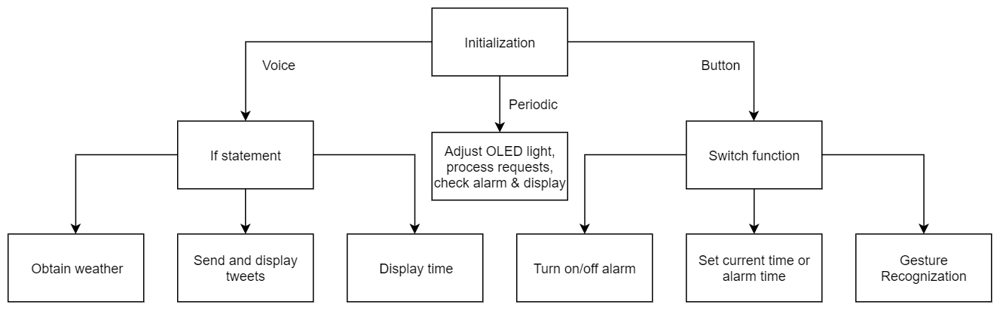

# Python-based Voice-control Smartwatch
## Author: Zhifu Xiao

# Summary

In this full-stack development project including hardware, software, web interface and backend database, I analyzed needs for a smartwatch and built a smartwatch with OLED screen, various sensors, and a micro-controller (Huzzah, similar to Raspberry Pi) using Python. Developed the interactional functions including set time, turn on/off display, set timer, obtain location and temperature, motion control, etc. using buttons as well as using Android Companion App. Developed an Android Companion App to connect and control smartwatch with voice control. Use NLP to dynamically recognize the voice command and send the right command to the smartwatch. For gesture recognition, use MongoDB as backend database to store data from the accelerometer and detect the real-time sensor data using Neural Network and Support Vector Classifier to realize different functionalities including turn on display when raise hands, switch to different panels when turning around, etc. with ~90% accuracy rate.

# Reference
I used the code from Google Cloud Platform as the starter code for the Android application. I made several major changes based on that:
1. I added two new layouts displaying the return messages and possible error messages.
2. I added a textview to input ip addresses, and a button to test connection.
3. I implemented the sendMessage function to send GET message to the board and receive the feedback messsage.
Besides that, I also used and modifyed the code for establishing the python HTTP server. The links are shown below: 

https://github.com/GoogleCloudPlatform/android-docs-samples

https://www.pi4iot.com/doku.php?id=sbc:esp8266

https://gist.github.com/bradmontgomery/2219997
